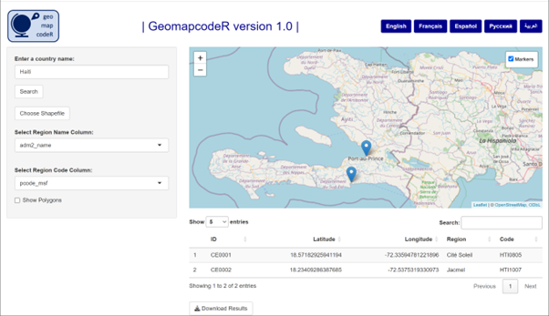

<!-- README.md is generated from README.Rmd. Please edit that file -->

```{r setup, include = FALSE}
knitr::opts_chunk$set(
  collapse = TRUE,
  comment = "#>",
  fig.path = "man/figures/README-",
  out.width = "100%"
)
```

# Background


### Who this app is for:

The `Geomapcoder` app has been developed to support epidemiologists conducting disease surveillance or outbreak investigations in settings where it is difficult to accurately geolocate cases, but where an understanding of spatial distribution is essential for the implementation of effective control measures. 

Specifically, this app may be most useful to data entry clerks, health facility reception staff, or survey teams, who know the areas their patients are coming from (or other points of interest) well enough to visually locate them on a high resolution interactive map.


### How it works:

The user first types the name of the region and country of interest.  This will trigger the canvas to be populated by an interactive leaflet map, zoomed in on the selected region.  From there, the user can zoom in further on the map until they locate the address of interest to a suitable level (for example the street on which a patient lives) and click on the map to create a point of interest.  This will in turn trigger a dialogue box to appear, where the user can type in an identifier for this point (for example the patient ID number).  The table underneath the map will automatically be populated by the identifier and GPS coordinates.  This process can be repeated for different addresses as many times as necessary. 
 
Optionally, the user can choose to upload shapefiles with boundaries (polygons) for an administrative level of interest (for example level 2 regions of a country).  Shapefiles for four administrative levels for Haiti are included as an example, but users can also upload their own shapefiles for any other country. The table below the map will automatically be populated with the region name and code for each recorded point of interest. 

At the end, the user can export the table with identifiers and coordinates to a .csv file.  The .csv file can then be uploaded to or merged with other databases based on the common identifier.




### Example use cases:

 1. Getting GPS coordinates for street-level patient addresses
 2. Getting GPS coordinates of villages not currently marked on OpenStreetMap
 3. Getting GPS coordinates of water sources relative to patients in a cholera outbreak


# Installing the app


### Requirements:

This is an R Shiny app designed to be used on a desktop computer, laptop or tablet.  When the basic interface is ready, it will be compiled into an R package.  It is suggested that users install this on their local computers if intending to geolocate sensitive data (such as patient addresses).  

Note that an internet connection is required to install the app and also to download the leaflet map tiles for a new country. It is however possible to save the map tiles for a given country when the app is first used, and select the saved files on subsequent use. In this case, an internet connection is no longer needed.

The app will be provided as an R package in the first instance.  The user will need to have R, RStudio and Rtools already installed prior to installing the app.  In a future version, the app will be wrapped into a standalone executable file compiled with `RInno`.  In this case, all the required software (including R) will be installed in a single step. 

A cloud-based version of this app may be made available for testing using Github codespaces in the future.


### Special features and future developments:

This app is being developed as a multilingual app.  Users can choose between English, French, Spanish, Russian and Arabic (the five UN languages) by clicking on the relevant language button at the top right of the app.  This will trigger all text and button labels in the app to be refreshed and shown in the selected language. If you spot any translation errors, please raise an issue (see below). 


### Reporting errors and bugs or requesting enhancements:

To report problems (errors or bugs), please create a new [issue here](https://github.com/AmyMikhail/Geomapcoder/issues). Copy the error from your R console into the issue box, or upload a screenshot of the error if it appears on the Shiny app itself.  Please also provide any additional descriptions about what went wrong in the issue text and make sure to label it as a `bug` before posting.

You can also create an issue to request new features or enhancements to the app  (select `enhancement` or `documentation` labels as appropriate).
 

### Maintenance:

This project is currently being maintained by [Amy Mikhail](https://github.com/AmyMikhail).  

Contributions are welcome: please contact the maintainer to request access.
